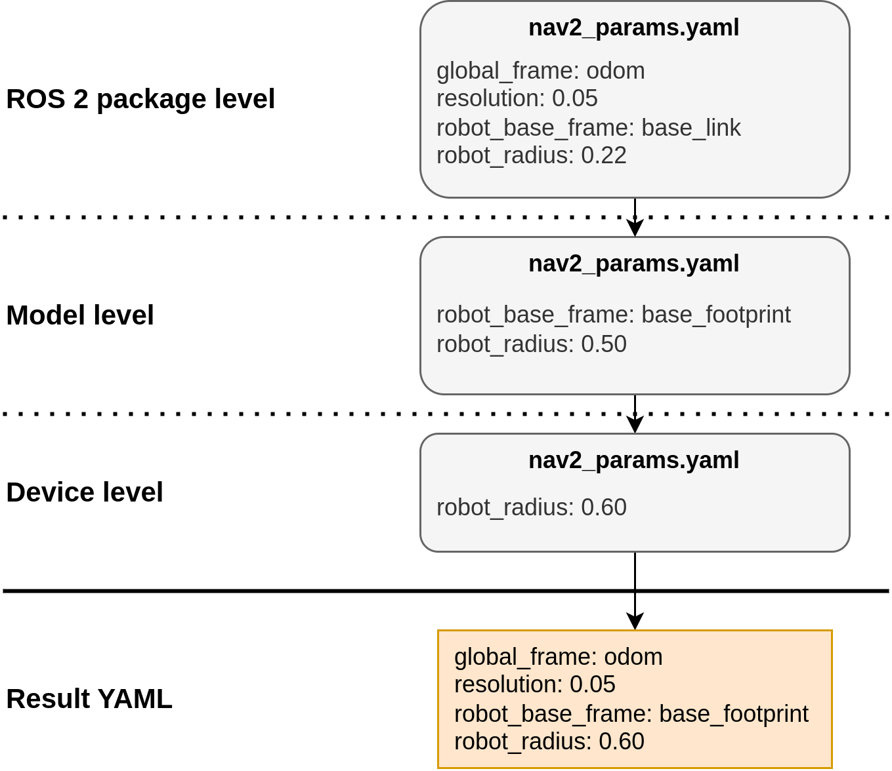

= Parameter configuration

Managing Node parameters in ROS 2 can be a daunting task, whether you're configuring a single robot or orchestrating a fleet. Parameter Configuration steps in to streamline this process, helping to avoid parameter duplication and easing the process of setting parameters by providing two main features: *YAML placeholders* and *YAML file overlaying*.

=== YAML placeholders
YAML files natively lack support for placeholders, making dynamic parameter setting difficult. Parameter Configuration introduces "tags" that enable runtime evaluation of placeholders.


Available tags:

* *Eval*: Evaluates commands in runtime, supporting file-level variables, environment variables, math expressions, ROS package paths, and more.
* *From*: Retrieves values from other YAML files.
* *Include*: Fully includes another configuration file
* *Merge*: Merges multiple key-value pairs to be under a single key

// Raw
////
ros_node:
  ros__parameters:
    robot_base_frame: base_link
    scan_topic: /scan
    map_file: !eval join(env.HOME, "maps")
    bt_path: !eval path_to("behavior_trees_pkg") + "/bt/nav_to_pose.xml"
    robot_radius: !eval 0.6 / 2
////

// Result
////
ros_node:
  ros__parameters:
    robot_base_frame: base_link
    scan_topic: /scan
    map_file: /home/user/maps
    bt_path: /ros2_ws/src/behavior_trees_pkg/bt/nav_to_pose.xml"
    robot_radius: 0.3
////

=== YAML file overlaying
YAML overlaying allows to set parameter overrides per device and robot model. This will greatly reduce the parameter duplication, since only the overridden parameters need to be defined.



The overlaying will automatically look for parameter files across three different levels:

* Device level
* Model level
* ROS Package level

For example, any parameter that is set in Device level configuration, will override Model level and ROS Package level configurations. Overlaying files need to have `!overlay` tag in the beginning of the file, otherwise it won't be overlaid with a level below. Check out the tutorials in link:examples[examples] folder.

This level structure is also extendable, so that you can have your custom configuration for the overlaying levels.

== Setup [[setup]]

For YAML overlaying feature, the Device and Model layer parameters are automatically fetched from a preconfigured folder. To use the  overlaying, follow these steps:

. Create a new config directory and device and model folders under it. Add your overlaying parameter files under ROS package folders. Names of the parameter files need to match the ROS package parameter file. Structure of the directory should be the following:
+


. Set `PARAM_CONFIG_DIR` env variable to point to the folder from which the overlaying fetches the parameters. For example:

[source]
----
export PARAM_CONFIG_DIR=/home/user/config_dir
----

// This is used to generate the image for folder structure. GitHub doesn't support this format directly.
////
[plantuml, format=svg, opts="inline"]
----
skinparam Legend {
	BackgroundColor transparent
	BorderColor transparent
	FontName "Noto Serif", "DejaVu Serif", serif
	FontSize 17
}
legend
config_dir
|_ model
  |_ <ros-pkg-name>
    |_ <param_file_1>.yaml
    |_ <param_file_2>.yaml
    |_ ...
|_ device
  |_ <ros-pkg-name>
    |_ <param_file_1>.yaml
    |_ ...
end legend
----
////

== Usage in launch files

To use these YAML files in ROS 2 launch files, get the configuration file in the following way with absolute path or with overlay syntax:
```
from param_configuration.configuration import get_resolved_yaml

# Absolute path
resolved_yaml = get_resolved_yaml("/home/user/config.yaml")

# Overlay syntax
resolved_yaml_2 = get_resolved_yaml("config://nav2_bringup/nav2_params.yaml")
```

The overlay syntax is built as follows:

* `config://` tells parameter configuration to use the overlay files to resolve the configuration
* The package name `nav2_bringup` tells the configuration to also use the ROS Package layer. If not set, uses only the Model and Device parameters.
* `nav2_params.yaml` is the name of the parameter file and is expected to be found in `nav2_bringup` ROS package. If a parameter files with a same name exist in `device` and/or `model` folders, we will use them to override the ROS-level parameters.

NOTE:: The parameter files are expected to be in `params` folder within the ROS package, unlike within the `device` or `model` folders!


== Config validation [[config]]
Configurations can be easily validated with a provided command line tool `config`. Validate a single configuration file by printing the evaluated version of it.
[source]
----
config print /home/user/param_config.yaml
----

Print the configuration overlay structure
[source]
----
config list --config-directory /home/user/config_dir/
----

If `--config-directory` is not given, uses the default `PARAM_CONFIG_DIR` directory.

More information with the command `config --help`

== Requirements

The package requires Python dependencies in the `requirements.txt` to be installed. Install them easily with

    pip3 install -r requirements.txt

== Examples and tutorials

Examples and tutorials can be found in link:examples[examples] folder.

== Supported Eval -commands
[cols="1,1,1"]
|===
|Command | Python function |Description

|!eval env.<env_var_name>
| os.environ.
|Environmental variable

|!eval m.<math_function>
|math.
|Any math expression

|!eval np.<numpy_function>
|numpy.
|Any numpy expression. Supports float64 and int64 types.

|!eval round()
|round()
|Rounds to given decimals

|!eval path_to()
|get_package_share_directory()
|Path to ROS package share directory

|!eval join()
|os.path.join()
|Join two or more paths

|!eval get_resolved_yaml()
|param_configuration.configuration.get_resolved_yaml
|Resolves the given YAML file and returns a path to it.

|!eval var.<var_name>
|-
|Allows using variables which are defined in the beginning of the same file, under ".variables" -key. This key will be removed from the result file.

|===


== Disclaimer
This package is under active development and changes. The usage and API may change rapidly and is not tied to ROS 2 release cycles, which is why we suggest to clone the stable release tag of this repository to avoid unintentional system breakdowns.

If you have feature requests or find any bugs or usability issues, please open a new issue with a low barrier. We are looking to solve them quickly.


== Known limitations

* ROS layer parameters have to be in "params" -folder
* Eval variables support only two levels of nesting:
** SUPPORTED: var_1: 1
** SUPPORTED: var_2: !eval var.var_1 + 1
** NOT SUPPORTED: var_3: !eval var.var_2 + 1
* Comments might be on the wrong lines in the resolved YAML

== Open questions
Since the package is still in an experimental phase, there are still many open questions. For example:

* How to store secret parameters such as passwords
* What is the best git config repo folder structure, when we have more layers than just model and device?
* How to easily configure a custom amount of the layers?
* How to handle parameter setting in runtime with dynamic parameters?
* Is there a better syntax for YAML placeholders, such as using the curly brackets?
* Should there be changes to the git config repo directory structure, if the parameters are deployed to multiple different computers on a single device?
* What is the best way of identifying the software version and version of the device parameters?


== Acknowledgements

Current active maintainers:

- https://www.linkedin.com/in/martmoerdijk/[Mart Moerdijk], Karelics Oy - Main author

- https://www.linkedin.com/in/janne-karttunen-a22375209/[Janne Karttunen] - Secondary author

The initial version of the Parameter Configuration was developed at https://karelics.fi/[Karelics Oy]. This project came to life through the efforts of the following individuals, who contributed to its design, implementation, testing, reviewing and maintenance: https://www.linkedin.com/in/martmoerdijk/[Mart Moerdijk], https://www.linkedin.com/in/janne-karttunen-a22375209/[Janne Karttunen], https://www.linkedin.com/in/joni-p%C3%B6ll%C3%A4nen-a05378139/[Joni Pöllänen], https://www.linkedin.com/in/taneli-korhonen-669100177/[Taneli Korhonen], https://www.linkedin.com/in/lowellausen/[Leonardo Wellausen], and https://www.linkedin.com/in/pekka-myller-68a7301b9/[Pekka Myller].
